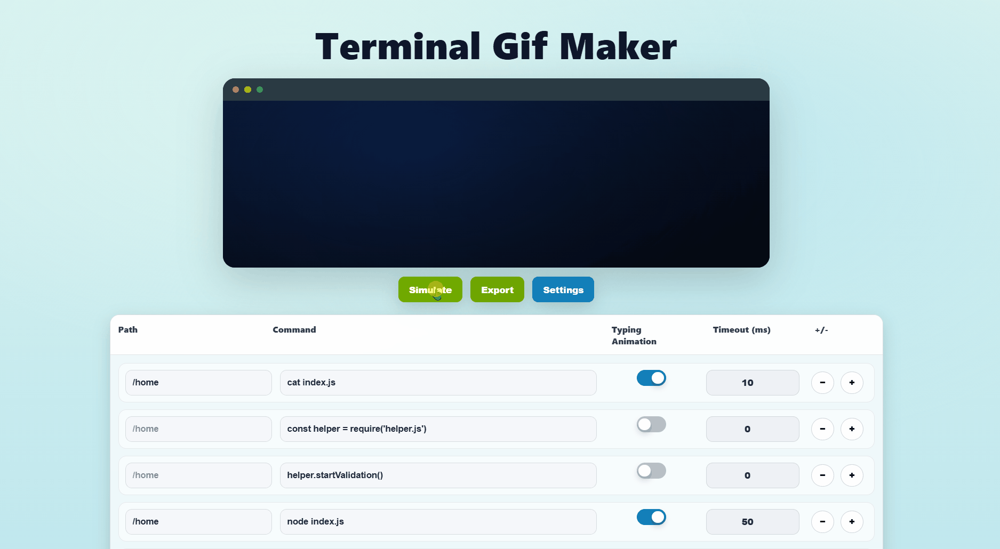
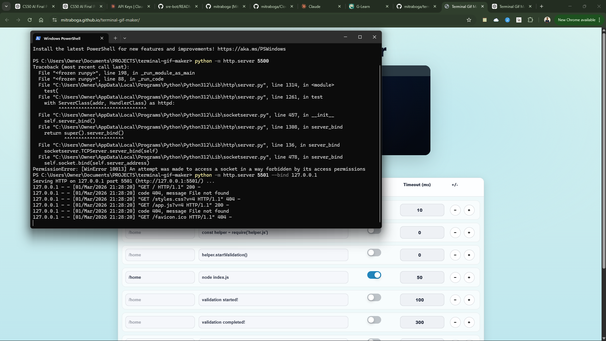
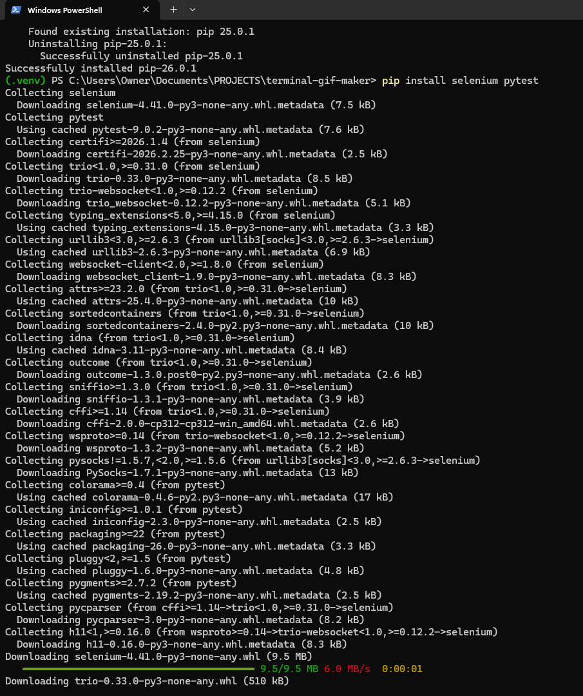
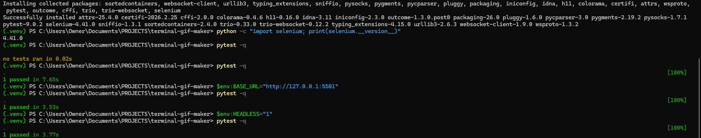
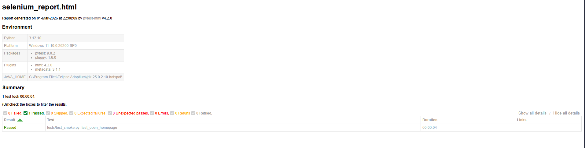

<h1 align="center">👾 Terminal GIF Maker 🔗</h1>
<h5 align="center">A tiny, browser-based tool that turns terminal-style text into clean GIFs — perfect for READMEs, demos, and indie hacker updates.</h5>

<p align="center">


</p>

<p align="center">

</p>

---

# 🧠 Why I made this?

I created this Terminal GIF maker since I wanted to enhance my README.md page for my GitHub profile page. I found some online, but I wanted more customization and for it to have the UX visual look I wanted for my README.md page. I decided to spin up a quick web app that allows anyone to create a totally custom GIF in a visual style resembling that of a terminal.

<br>

<p align="center">

</p>

---

# 💭 What you can do

- **Type + style** terminal output (fonts, colours, spacing, window chrome)  
- **Preview/edit** before exporting (no surprises)  
- Export as **GIF** (and **MP4**) directly from the browser  
- Works great on **GitHub Pages** (no backend needed)

---

# 📋 How to use

1. Open the app.  
2. Edit your terminal content and tweak the styling.  
3. Click **Simulate** to preview the animation.  
4. Click **Export** → choose **GIF** or **MP4**.

---

# 🔃 Run locally

Open `index.html` in your browser.

For a simple local server (recommended):

- VS Code → install **Live Server** → right click `index.html` → **Open with Live Server**

---

# 🧪 Selenium Testing

To ensure the reliability and functionality of the Terminal GIF Maker web application, I implemented **automated browser testing using Selenium and Pytest**.

Selenium allowed me to simulate real user interactions with the web interface and validate that the application loads correctly and behaves as expected in a real browser environment.

### Testing Setup

The testing workflow involved:

- Creating a **Python virtual environment**
- Installing **Selenium** and **Pytest**
- Running automated tests against a **local development server**
- Generating a **test report for verification**

### Installation

```bash
pip install selenium pytest
```

### Example Test Execution

The automated test verifies that the web application loads successfully and that the homepage renders without errors.

```bash
pytest -q
```

### Test Workflow

1. Launch a local server for the project.
2. Use Selenium WebDriver to open the application in a browser.
3. Validate that the homepage loads successfully.
4. Confirm that UI elements are rendered correctly.
5. Generate a Pytest HTML test report.

---

### 📷 Selenium Setup and Test Execution

<p align="center">

</p>

*Setting up the local server and preparing the environment for automated testing.*

---

<p align="center">

</p>

*Installing Selenium and Pytest dependencies required for browser automation testing.*

---

<p align="center">

</p>

*Running automated tests using Pytest to validate application functionality.*

---

<p align="center">

</p>

*Generated HTML test report showing successful execution of the Selenium test case.*

---

Using Selenium testing ensures that future updates to the application can be validated quickly through **automated regression testing**, helping maintain reliability as the project evolves.

---

# 🚀 Deploy (GitHub Pages)

1. Push this project to a GitHub repo.  
2. Go to **Settings → Pages**  
3. Set Source to your branch (usually `main`) and root folder (`/`)  
4. Save — your site will be live on your Pages URL.

---

## 👤 Author

<p align="center">
  <b style="font-size:18px;">Mitra Boga</b><br/><br/>

  <a href="https://www.linkedin.com/in/bogamitra/" target="_blank" rel="noopener noreferrer">
    
  </a>

  <a href="https://x.com/techtraboga" target="_blank" rel="noopener noreferrer">
    
  </a>
</p>
